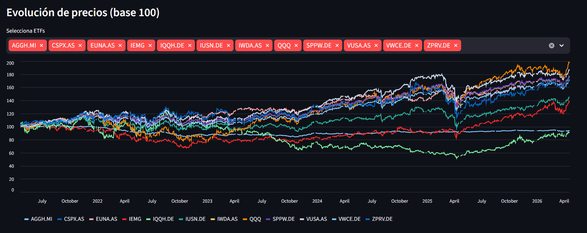

# 📊 FinSight — ETF Risk Screener


**FinSight** is an interactive ETF risk screener built with Python and Streamlit. It combines quantitative risk metrics with real-time news sentiment analysis to give investors a quick, data-driven overview of 12 popular ETFs.

🔗 **Live dashboard → [finsight-aiborfr.streamlit.app](https://finsight-aiborfr.streamlit.app)**

---



---

## Features

| # | Feature | Description |
|---|---------|-------------|
| 1 | **Price History Download** | Fetches 5 years of adjusted closing prices for 12 ETFs via `yfinance` and stores them locally |
| 2 | **Risk Metrics** | Computes annualised volatility, Sharpe Ratio, maximum drawdown and total return for each ETF |
| 3 | **News Sentiment Analysis** | Pulls recent articles from NewsAPI and scores them with VADER, producing a compound sentiment score per ETF |
| 4 | **Interactive Dashboard** | Streamlit app with a combined risk + sentiment table, normalised price chart, per-ETF detail view and sentiment ranking |

---

## Tech Stack

| Layer | Technology |
|-------|-----------|
| Data retrieval | `yfinance`, `requests` |
| Data processing | `pandas`, `numpy` |
| Sentiment analysis | `vaderSentiment`, NewsAPI |
| Dashboard | `streamlit` |
| Environment | `python-dotenv` |
| Notebooks | `jupyter` |

---

## ETFs Covered

`IWDA.AS` · `VUSA.AS` · `CSPX.AS` · `EUNA.AS` · `IEMG` · `QQQ` · `VWCE.DE` · `SPPW.DE` · `IUSN.DE` · `ZPRV.DE` · `AGGH.MI` · `IQQH.DE`

---

## Local Setup

### 1. Clone the repository

```bash
git clone https://github.com/Aiborfr/finsight.git
cd finsight
```

### 2. Create and activate a virtual environment

```bash
python -m venv .venv

# Windows
.venv\Scripts\activate

# macOS / Linux
source .venv/bin/activate
```

### 3. Install dependencies

```bash
pip install -r requirements.txt
```

### 4. Configure environment variables

Create a `.env` file in the project root:

```env
NEWSAPI_KEY=your_newsapi_key_here
```

Get a free API key at [newsapi.org](https://newsapi.org).

### 5. Run the dashboard

```bash
streamlit run app.py
```

The app will open at `http://localhost:8501`. On first launch it will automatically download price data and run sentiment analysis (~30 seconds).

---

## Project Structure

```
finsight/
├── app.py                  # Streamlit dashboard entry point
├── requirements.txt        # Python dependencies
├── .env                    # API keys (not committed)
│
├── data/
│   ├── raw/
│   │   └── etf_prices.csv          # Downloaded price history
│   └── processed/
│       ├── etf_metrics.csv         # Computed risk metrics
│       └── sentiment_scores.csv    # VADER sentiment scores
│
├── src/
│   ├── screener/
│   │   ├── screener.py     # Downloads ETF price data via yfinance
│   │   └── metrics.py      # Computes volatility, Sharpe, drawdown
│   ├── sentiment/
│   │   └── sentiment.py    # Fetches news and scores sentiment with VADER
│   └── utils/
│
├── notebooks/              # Exploratory analysis (Jupyter)
└── tests/
```

---

## Streamlit Cloud Deployment

The app is deployed on Streamlit Community Cloud. To deploy your own instance:

1. Fork this repository
2. Go to [share.streamlit.io](https://share.streamlit.io) and connect your fork
3. Add your `NEWSAPI_KEY` under **Settings → Secrets**:

```toml
NEWSAPI_KEY = "your_newsapi_key_here"
```

---

## License

MIT © [Aiborfr](https://github.com/Aiborfr)
